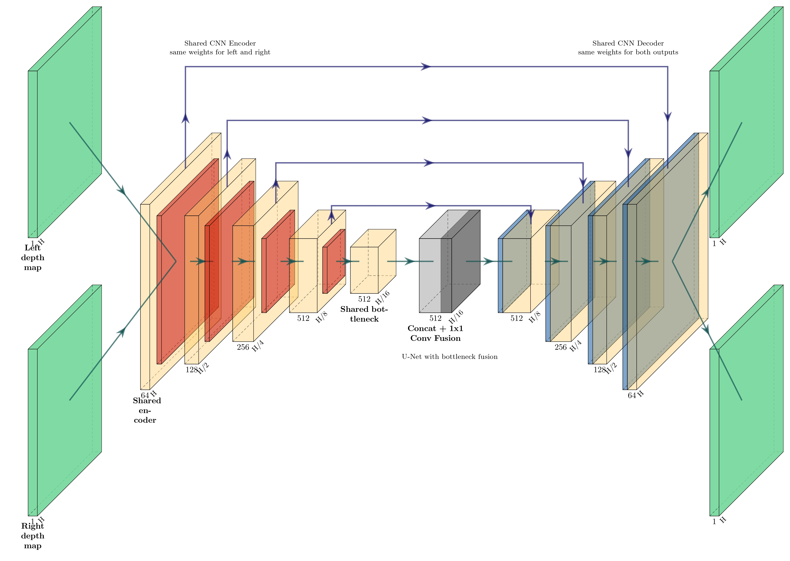
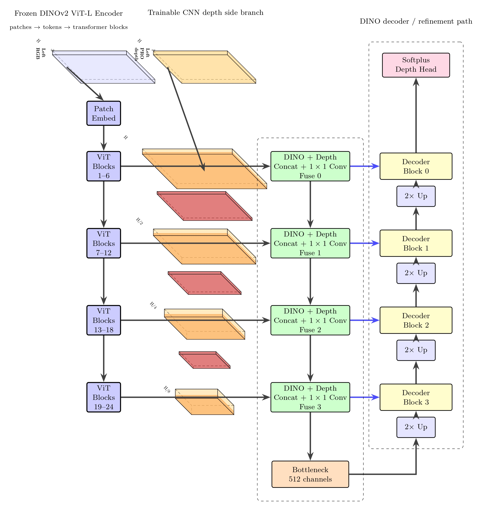

# spur-da2ft-depth-experiments

Vision-based **metric depth estimation for robotic apple-tree pruning**.
Synthetic-data pipeline, Depth Anything V2 fine-tuning code, and stereo /
multi-view refinement ablations (CNN U-Net and DINOv2 + depth-side branch).

### Built With

[](https://www.python.org/)
[](https://pytorch.org/)
[](https://www.blender.org/)
[](https://github.com/facebookresearch/dinov2)
[](https://github.com/DepthAnything/Depth-Anything-V2)

## 📑 Table of Contents

- [Project Identity](#-project-identity)
- [Problem & Application](#-problem--application)
- [Setup](#-setup)
- [Models & Weights](#-models--weights)
- [Generating the Dataset](#-generating-the-dataset)
- [Running an Experiment](#%EF%B8%8F-running-an-experiment)
- [Architecture](#-architecture)
  - [Single-Image DA2 Fine-Tune](#single-image-da2-fine-tune)
  - [CNN Stereo U-Net (`MVStereoUNet`)](#cnn-stereo-u-net-mvstereounet)
  - [DINOv2 + Depth-Side Branch (`MVStereoDINOUNet`)](#dinov2--depth-side-branch-mvstereodinounet)
- [Code Organization](#-code-organization)
- [Results](#-results)
- [Hardware Constraints](#%EF%B8%8F-hardware-constraints)
- [Developer References](#developer-references)
- [Contact](#contact)

---

## 📌 Project Identity

- **Author:** Jose Sanchez — Oregon State University
- **Status:** report + reproducible release, Jun 2026

## 🌟 Problem & Application

Robotic pruning of dormant apple trees needs **metric depth at the trunk pixel**
so a cutting tool can be positioned to within a few centimeters. Real depth
sensors are sparse and noisy in outdoor orchards; off-the-shelf monocular
models drift in scale. We use **synthetic Blender renders** (RGB + dense GT
depth + trunk/box masks + camera intrinsics + 6-DoF pose) of 100 Envy/UFO
trees with four bark textures as a controlled test bed for three strategies:
zero-shot + α/β calibration, **fine-tuned Depth Anything V2**, and **stereo
RGB-D refinement** with either a from-scratch CNN U-Net or a frozen DINOv2
ViT-L paired with a trainable depth-side branch.

**Headline finding** — targeted synthetic fine-tuning beats both zero-shot
calibration and stereo refinement alone. Pretrained RGB encoders only help
refinement when the input depth is already metric (i.e., already from the
fine-tuned DA2 model). For real-time pruning, single-view DA2 fine-tune at
~80 ms/frame is the practical pick (~0.0598 m trunk RMSE); 3-pair DINO
refinement gets the lowest error (**0.0445 m**) at ~80 ms/view across 6
views.

## 📘 Setup

```bash
git clone https://github.com/joses2017smjh/spur-da2ft-depth-experiments.git
cd spur-da2ft-depth-experiments

conda create -n spur python=3.10
conda activate spur
pip install -r requirements.txt
```

## 🔽 Models & Weights

| Weight                                     | Source                                                  | Place under |
| ---                                        | ---                                                     | --- |
| **Depth Anything V2 ViT-L** (pretrained)   | <https://github.com/DepthAnything/Depth-Anything-V2>     | `da2_weights/depth_anything_v2_vitl.pth` |
| **DINOv2 ViT-L**                           | auto-downloaded by torch hub on first run               | `~/.cache/torch/hub/` |
| **PatchRefineOnce (PRO)**                  | <https://github.com/inkyu-kwon/PatchRefineOnce>          | `pretrained/PRO/PRO.pth` |
| **DA2 fine-tuned (ours)** — optional       | release page (see GitHub Releases)                      | `checkpoints/da2_metric/best.pth` |

Quick download example:

```bash
mkdir -p da2_weights
wget -O da2_weights/depth_anything_v2_vitl.pth \
  https://huggingface.co/depth-anything/Depth-Anything-V2-Large/resolve/main/depth_anything_v2_vitl.pth
```

## 🌳 Generating the Dataset

Required assets (shipped in this repo unless noted):

| Asset                  | Location                              |
| ---                    | ---                                   |
| Blender scene          | `orchard_template.blend`              |
| Tree geometry (.ply)   | `trees/ply/lpy_envy_*.ply`            |
| Tree metadata (JSON)   | `trees/metadata/lpy_envy_*_metadata.json` |
| Bark textures (4)      | `textures/bark_{brown,brown_02,willow,willow_02}/` (`_diff_4k.jpg` + `_nor_gl_4k.exr`) |

**Renderer entry point:** [`Dataloader/generate_tree2.py`](Dataloader/generate_tree2.py). Driven entirely by env vars + a few hard-coded constants:

| Knob                | Type         | Effect |
| ---                 | ---          | --- |
| `BARK_NAME`         | env          | Texture set to apply (`bark_brown_02`, …). |
| `TREE_ID`           | env          | Which `lpy_envy_*` model. |
| `CV_OUTPUT_DIR`     | env          | Output root (creates `rgb/`, `depth/`, `mask/`, `Optical_flow/`, `ann/`, `box_mask/`). |
| `CV_FORCE_RENDER=1` | env          | Re-render even if outputs exist. |
| `RENDER_BOX`        | const (True) | Add the fixed ~30 cm box anchor (~15 × 7 cm). |
| `SHOTS`             | const        | Six fixed camera poses per (tree, set_id). |
| `SET_IDS`           | const        | `box`, `box_cam1..8`, `cam1..10`. |
| `process_res`       | const (504)  | Internal processing resolution. |

Smoke test:

```bash
BARK_NAME=bark_brown_02 TREE_ID=lpy_envy_00001 \
CV_OUTPUT_DIR=./Data/full_spur CV_FORCE_RENDER=1 \
blender -b orchard_template.blend -P Dataloader/generate_tree2.py
```

Full sweep (100 trees × 1 texture):

```bash
for i in $(seq -f "%05g" 0 99); do
  BARK_NAME=bark_brown_02 TREE_ID=lpy_envy_$i \
  CV_OUTPUT_DIR=./Data/full_spur \
  blender -b orchard_template.blend -P Dataloader/generate_tree2.py
done
```

Output layout:

```
Data/<dataset>/
  rgb/<bark>/<tree>/<set_id>/<tree>_<shot>.png
  Optical_flow/<bark>/<tree>/<set_id>/<tree>_<shot>_{l,r}.png
  depth/<bark>/<tree>/<set_id>/<tree>_<shot>_{l,r,_}.npy
  mask/<bark>/<tree>/<set_id>/<tree>_<shot>_{l,r,_}.png
  ann/<bark>/<tree>/<set_id>/<tree>_<shot>_{l,r}.json
  pro_refine/...      (after PRO inference)
  Da2Finetune/...     (after DA2 inference)
```

## ▶️ Running an Experiment

Example: **DINOv2 RGB+D refiner, 3 stereo pairs, DA2-fine-tuned input
depth, fusion ON, no pose** (our best configuration → 0.0445 m RMSE).

```bash
# (1) Generate DA2-fine-tune depth for the frames the refiner will see.
#     Reads frame list, runs the fine-tuned DA2 model, writes to Da2Finetune/.
python scripts/infer_da2_finetune_batch.py \
  --frame-list   manifests/da2finetune_frames.txt \
  --ckpt         checkpoints/da2_metric/best.pth \
  --da2-root     depth-anything-v2/metric_depth \
  --max-depth    20.0

# (2) Launch the refiner for one seed (single GPU, no SLURM).
SLURM_ARRAY_TASK_ID=1 \
DATASET=full_spur \
INPUT_DEPTH_SUBDIR=Da2Finetune \
bash run_spur_dino_da2ft_3pair_fusion_dgx2.sh

# (3) Watch the log.
tail -f logs/spur_dino_da2ft_3pair_fusion_nopose-*.out
```

What you'll see:

- per-epoch `train RMSE` / `val RMSE` / `loss`
- `best.pth` saved when val RMSE improves
- `Best checkpoint:` line at the end with the path

To switch to another experiment, just point at a different launcher:

| What changes | Knob | Example |
| --- | --- | --- |
| Refiner backbone     | script             | `run_spur_cnn_da2ft_*` (CNN) vs `run_spur_dino_da2ft_*` (DINO) |
| # stereo pairs       | script suffix      | `…_1pair_…` / `…_2pair_…` / `…_3pair_…` / `…_4pair_…` |
| Input depth source   | `INPUT_DEPTH_SUBDIR` env | `pro_refine` (raw PRO) / `Da2Finetune` (ours) |
| α/β calibration      | `--no_pro_calib` flag in script | present → off, absent → on |
| Cross-view fusion    | `--no_fusion` flag in script    | present → off |
| Pose input           | `--no_pose` flag in script      | present → off |
| Dataset              | `DATASET` env       | `full_trunk` / `full_spur` |

## 🧠 Architecture

Three-stage pipeline. Stage 1 generates synthetic RGB + GT depth in Blender.
Stage 2 fine-tunes a monocular foundation model (DA2). Stage 3 refines that
prediction with multi-view RGB + D.

### Single-Image DA2 Fine-Tune

[`train_depth_da2.py`](train_depth_da2.py) + [`dataset/trunk_da2.py`](dataset/trunk_da2.py).
DA2 ViT-L (~308 M params) is loaded from `--pretrained-from` and fine-tuned
end-to-end on synthetic RGB → metric depth. Loss is **SiLog over trunk-mask
pixels**, with four optional box-anchor variants (`--box-loss-mode` in
`{union, weighted, balanced, anchor}`) that mix in the fixed box-anchor
pixels. Validation: trunk-mask RMSE in meters.

Key flags ([`train_depth_da2.py`](train_depth_da2.py)):

```
--encoder vitl              # DA2 backbone variant
--pretrained-from PATH      # DA2 weights
--train-manifest CSV        # per-seed training manifest
--val-manifest   CSV
--epochs 80                 # patience-10 early stop in launchers
--lr 5e-6                   # ~5×10⁻⁶ baseline
--train-box-mask            # enable box pixels in loss
--box-loss-mode {union,weighted,balanced,anchor}
--max-runtime-seconds N     # wall-clock budget (graceful exit)
```

### CNN Stereo U-Net (`MVStereoUNet`)

[`MVP_MODEL/mvp_stereo_model.py`](MVP_MODEL/mvp_stereo_model.py) +
[`MVP_MODEL/train_mvp_stereo.py`](MVP_MODEL/train_mvp_stereo.py). Shared
encoder–decoder trained from scratch. Each view is encoded with the same
weights, the bottlenecks are concatenated along channels, a learned 1×1
convolution fuses them, and the decoder predicts refined depth per view.

<p align="center">
  
</p>

- **Input:** RGB+D channel-concatenated per view (or D-only via `--no_rgb`).
- **Cross-view fusion:** 1×1 Conv over `n_views × C` → `C` at the bottleneck (off via `--no_fusion`).
- **Output head:** `softplus` (`pred_mode=absolute`) or residual on input depth (`bounded_residual` / `adaptive_residual`).
- **Pose:** 3-scalar pose embedding (Δz, Δθz, Δr) injected into bottleneck (off via `--no_pose`).

### DINOv2 + Depth-Side Branch (`MVStereoDINOUNet`)

[`MVP_MODEL/mvp_stereo_dino_model.py`](MVP_MODEL/mvp_stereo_dino_model.py) +
[`MVP_MODEL/train_mvp_stereo_dino.py`](MVP_MODEL/train_mvp_stereo_dino.py).
Same multi-view recipe, but RGB and D are encoded by **two separate
streams**. RGB goes through a **frozen DINOv2 ViT-L** (provides pretrained
features), depth goes through a trainable CNN side-branch. The two streams
are merged via skip-connection projections + a bottleneck fuse.

<p align="center">
  
</p>

- **Backbone:** frozen DINOv2 ViT-L (`encoder.dino`), ~300 M frozen params + ~5 M trainable.
- **Depth branch:** `DepthSideBranch` (CNN) produces multi-scale features fused into the DINO skip path.
- **Cross-view fusion:** same 1×1 conv at the bottleneck.
- **Pair counts:** `--n_views 2/4/6/8` (single / 2 / 3 / 4 stereo pairs).
- **Optional partial fine-tune:** `--unfreeze_last_n N` or LoRA via `--lora_rank R` (off by default).
- **Pluecker rays:** `--use_plucker` injects per-pixel camera rays at skip + bottleneck (off by default).

## 🗂️ Code Organization

| Concern | File |
| --- | --- |
| Blender rendering           | [`Dataloader/generate_tree2.py`](Dataloader/generate_tree2.py) |
| DA2 fine-tune trainer       | [`train_depth_da2.py`](train_depth_da2.py) |
| DA2 single-image loader     | [`dataset/trunk_da2.py`](dataset/trunk_da2.py) |
| 1-pair stereo loader        | [`dataset/trunk_stereo_mvp.py`](dataset/trunk_stereo_mvp.py) |
| 2-pair stereo loader        | [`dataset/trunk_stereo_pair_mvp.py`](dataset/trunk_stereo_pair_mvp.py) |
| 3-pair stereo loader        | [`dataset/trunk_stereo_triplet_mvp.py`](dataset/trunk_stereo_triplet_mvp.py) |
| 4-pair stereo loader        | [`dataset/trunk_stereo_quad_mvp.py`](dataset/trunk_stereo_quad_mvp.py) |
| CNN refiner model           | [`MVP_MODEL/mvp_stereo_model.py`](MVP_MODEL/mvp_stereo_model.py) |
| DINO refiner model          | [`MVP_MODEL/mvp_stereo_dino_model.py`](MVP_MODEL/mvp_stereo_dino_model.py) |
| CNN refiner trainer         | [`MVP_MODEL/train_mvp_stereo.py`](MVP_MODEL/train_mvp_stereo.py) |
| DINO refiner trainer        | [`MVP_MODEL/train_mvp_stereo_dino.py`](MVP_MODEL/train_mvp_stereo_dino.py) |
| DA2 batch inference         | [`scripts/infer_da2_finetune_batch.py`](scripts/infer_da2_finetune_batch.py) |
| Canonical 80/20 manifests   | [`manifests/source/stereo_{train,val}_manifest.csv`](manifests/source/) |
| Experiment launchers        | `run_spur_*.sh` (top level) |

Common knobs you'll want to edit:

| Goal                                | Where                                                                 |
| ---                                 | ---                                                                   |
| Change input depth source           | `INPUT_DEPTH_SUBDIR` env (read in stereo loaders, e.g. `dataset/trunk_stereo_mvp.py:_DEPTH_SUBDIR_PRO`) |
| Disable α/β PRO calibration         | `--no_pro_calib` flag in any launcher                                 |
| Disable cross-view fusion           | `--no_fusion` flag in any DINO/CNN launcher                           |
| Disable pose embedding              | `--no_pose` flag in any DINO/CNN launcher                             |
| Change # stereo pairs               | `--n_views {2,4,6,8}` (DINO) or pick a different `_Npair_` launcher    |
| Change box-loss formulation         | `--box-loss-mode {union,weighted,balanced,anchor}` in `run_spur_boxlr_*.sh` |
| Swap dataset                        | `DATASET=full_trunk` or `full_spur`                                    |

## 📊 Results

All numbers are validation RMSE in meters on synthetic Envy/UFO trees,
single bark texture, 10 trees / 5 seeds / 80 epochs / patience 10.

| Method                                    | RMSE (m)              | Notes |
| ---                                       | ---                   | --- |
| DA2-ft single-view (trunk mask)           | $0.0598$              | trunk-only eval |
| DA2-ft single-view (full-tree)            | $0.0550$              | full-tree eval |
| **CNN RGB+D refinement**                  | $0.0503 \pm 0.0090$   | DA2-ft input, 4 stereo pairs |
| **DINO RGB+D refinement (best overall)**  | $\mathbf{0.0445 \pm 0.0057}$ | DA2-ft input, 3 stereo pairs |
| SPUR anchor loss (D)                      | $0.1136 \pm 0.0097$   | box as scale anchor only |

Cross-cutting observations:

- **Depth source dominates architecture.** Both refiners drop from
  ~0.10 m → ~0.05 m when the input depth is swapped from raw PRO to
  fine-tuned DA2.
- **Pretrained RGB only helps with good depth.** DINOv2 beats the CNN only
  when the input depth is DA2-fine-tuned; on raw PRO the CNN actually wins
  by ~24 %.
- **α/β calibration ≈ no-op for the refiners** when the encoder is strong
  enough to learn the scale internally.
- **Cross-view fusion** helps the CNN modestly (~5 %); for DINO it is
  essentially a no-op.
- **More views ≠ better.** DINO peaks at 3 pairs; CNN at 4 pairs; gains
  beyond 1 pair are within ±1 σ for DINO.

**For deployment** the practical pick is the single-view DA2 fine-tune at
~80 ms/frame (trunk RMSE ~0.060 m). The 3-pair DINO refiner buys ~0.015 m
of accuracy for ~6× the compute (6-view group ≈ 485 ms total) — useful for
offline planning, expensive for real-time pruning.

## 🖥️ Hardware Constraints

| Stage                                       | Minimum                       | Recommended                    |
| ---                                         | ---                           | ---                            |
| Blender render (per tree)                   | 16 GB RAM, any CUDA GPU (8 GB)| 32 GB RAM, RTX 3060+           |
| PRO / DA2 inference                         | 12 GB VRAM                    | 24 GB+ VRAM                    |
| **DA2 fine-tune** (ViT-L, bs=2)             | **24 GB VRAM**                | A40 / A100 / H100 / V100-32 GB |
| CNN stereo refiner (1 pair)                 | 12 GB VRAM                    | 24 GB                          |
| DINO refiner (1 pair, frozen ViT-L)         | 16 GB VRAM                    | 24 GB+                         |
| DINO refiner (3–4 pair)                     | 24 GB VRAM                    | 40 GB+ (A100 / H100)           |
| Disk for full dataset                       | —                             | ~250 GB                        |
| CPU / RAM during training                   | 8 cores, 32 GB                | 16 cores, 64 GB                |

Single-GPU desktop floor: **RTX 3090 / 4090 (24 GB)** runs every experiment
at `bs=2, H=280, W=512`, ~2–4× slower than the cluster. <16 GB VRAM cards
need reduced batch / resolution or the released `best.pth` instead of
re-training.

## Developer References

- **Depth Anything V2** — Yang et al., 2024. <https://github.com/DepthAnything/Depth-Anything-V2>
- **Depth Anything V3** — Lin et al., 2025. <https://github.com/depth-anything/Depth-Anything-V3>
- **PatchRefineOnce (PRO)** — Kwon et al., 2025. <https://github.com/inkyu-kwon/PatchRefineOnce>
- **DINOv2** — Oquab et al., 2023. <https://github.com/facebookresearch/dinov2>
- **U-Net** — Ronneberger et al., 2015. <https://arxiv.org/abs/1505.04597>
- **TilingZoeDepth** — Bill F. Smith. <https://github.com/BillFSmith/TilingZoeDepth>

## Contact

Jose Sanchez — sanchej7@oregonstate.edu
Oregon State University
